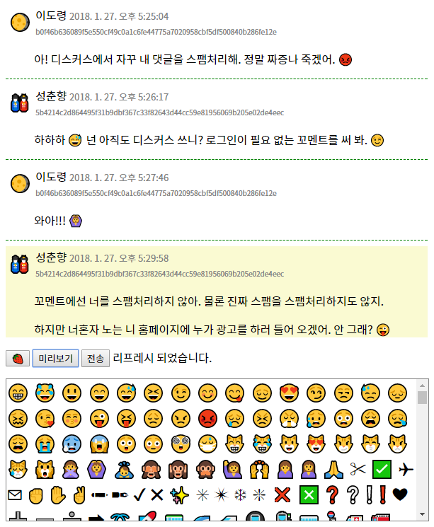

[끈닷넷](https://kkeun.net/) 꼬멘트 <sup>베타</sup>
======

Disqus에서
[내 글이 자꾸 스팸 처리](https://blog.kkeun.net/computer/2018-01-24-spam-of-disqus)
되어 답답해서 울면서 만든 댓글 시스템.

******

Screenshot
------



Features
------

### &#x1F46A; Public

누구나 글을 쓸 수 있다.  로그인이 없다.  이름과 비밀번호를 넣기는
하는데 이것들은 댓글 쓴 익명의 사람들을 구분하는 용도로만 쓰인다.

### &#x1F361; Simple list of comments

답글들은 단순한 리스트다.  트리가 아니다.  답글에 답글을 달 수 없다.
그런 종류의 답글을 지원하는 페이지가 많이 있지만 (페이스북, 레딧) 난
답글에 답글을 읽으면서 편안함을 느낀지 못했다.  아까 읽었던 게
뭐였는지 쉽게 까먹기 때문.

### &#x1F515; No notification

메일 알림 기능만 없어도 스팸 걱정이 준다.  게시판에 스팸이 쌓이는 건
나에겐 작은 문제이지만 그게 메일로 날아와 메일함에 쌓이는 건 크고
성가신 문제가 될 수 있다.

### &#x23F3; Proof-of-work (&#x1F6A7; 보류)

스팸에 작게 나마 대항하기 위해
[Proof-of-work](https://en.wikipedia.org/wiki/Proof-of-work_system)에
기반해서 댓글 등록 비용을 조금 높이려 한다.  채굴을 시키는 것도 염두에
두고 있기는 한데
[Coinhive의 부작용](https://blog.malwarebytes.com/security-world/2017/10/why-is-malwarebytes-blocking-coinhive/)을
보니 고민이 조금 된다.

일단 보류 상태.  스팸이 얼마나 활발한지 먼저 보자.

### &#x2795; 그 밖에

마크다운으로 글을 쓸 수 있고, 이모지도 쉽게 글에 넣을 수 있다.

### &#x1F480; Features not supported

다음 기능은 제공되지 않고 있다.  (요청이 생기면 추후에 추가될지도)

* 코멘트 수정/삭제
* 관리자 페이지, import, export 등등

난 이대로도 충분히 좋다.  적어도 내가 댓글을 달면 댓글이 달린다.

How to use
------

기본적으로 읽어 와야 하는 자바스크립트는 다음과 같다.

``````
<script src='https://cdn.rawgit.com/jackmoore/autosize/4.0.0/dist/autosize.min.js'></script>
<script src='https://cdnjs.cloudflare.com/ajax/libs/showdown/1.8.6/showdown.min.js'></script>
<script src='https://cdnjs.cloudflare.com/ajax/libs/js-sha256/0.9.0/sha256.min.js'></script>
<script src="https://cdn.rawgit.com/kkeundotnet/kkoment/0.2/kkoment.min.js" charset="UTF-8"></script>
``````

### 댓글 쓰레드 넣기

댓글 쓰레드를 넣고 싶은 페이지에 다음을 추가한다.

``````
<div id="kkoment-div"></div>
<script>kkoment_load("kkoment-div", "https://my.domain.net", "my-thread-name");</script>
``````

*   `kkoment-div`는 댓글이 들어갈 `div`의 `id`이고 이는
    `kkoment_load` 함수의 첫 번째 인자로 넘어간다.

*   `kkoment_load`의 두 번째와 세 번째 인자는 각각 댓글 쓰레드를
    메다는 페이지의 도메인 이름과 댓글 쓰레드 이름이다.  댓글
    쓰레드 이름은 사용자 마음대로 정하면 된다.

&#x26A0; `div`의 `id`와 댓글 쓰레드 이름만 다르게 하면 한 페이지에 여러
댓글 쓰레드를 달 수도 있다.  그럴 일이 자주는 없겠지만.

### 쓰레드 별 댓글 개수

다음과 같이 댓글 개수를 서버로부터 읽어올 수 있다.  댓글이 없는
경우에는 '0'을 출력한다.

``````
<span class="kkoment-num" data-kkoment-thread-id="hello"></span>
<span class="kkoment-num" data-kkoment-thread-id="bye"></span>
...
<script>kkoment_load_n("https://kkoment.kkeun.net")</script>
``````

댓글 개수 표현 형식을 콜백 함수를 통해 사용자가 원하는 대로 변경할 수
있다.

``````
<span class="kkoment-num" data-kkoment-thread-id="hello"></span>
<script>kkoment_load_n("https://kkoment.kkeun.net", function(n){
    if(n) {
        return n+"개";
    } else {
        return "없음";
    }});
</script>
``````

위와 같은 경우에 댓글이 없으면 "없음"을, 그렇지 않으면 "n개"를
출력한다.  참고로 콜백 함수의 인자 `n`은 `int` 타입이다.

### 직접 설치

[깃허브](https://github.com/kkeundotnet/kkoment)에 소스코드가 공개되어
있다.  마음껏 가져가서 써도 좋다.

* `kkoment.js`에서 `kkoment_domain` 값을 새로 설정하고,
* `_db`와 `_db/kkoment.db`를 `www-data`가 읽고 쓸 수 있도록 파일
  권한을 설정한다.

Thanks to
------

꼬멘트는 다음 라이브러리들을 사용하고 있다.  감사합니다.  Thank you!

* [PHP Simple HTML DOM Parser](http://sourceforge.net/projects/simplehtmldom/)
  by Yousuke Kumakura, Vadim Voituk, Antcs, S.C.&nbsp;Chen, John
  Schlick(PaperG), and Rus Carroll
* [Autosize](http://www.jacklmoore.com/autosize/) by Jack Moore
* [Showdown](http://showdownjs.com/) by Estevão Soares dos Santos(tievie)
* [js-sha256](https://github.com/emn178/js-sha256) by Yi-Cyuan Chen
* [RawGit](https://rawgit.com/) by Ryan Grove
* [Cloudflare](https://www.cloudflare.com/) by Cloudflare Inc.

내 블로그에 답글을 달아 주며 꿈과 용기를 준
[woojs](https://blog.woojs.net/) 님, [Bloofer](https://jmyang.kr/)
님께도 감사를 드립니다.

License
------

이 프로그램은 퍼블릭 도메인으로 공개됩니다.  `simple_html_dom.php`(MIT
라이선스)는 제외.
